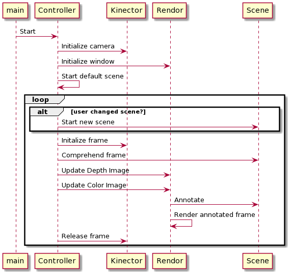

# bones
Demonstrates Azure Kinect DK camera body tracking features.  Watch this youtube video to see the features in action.


## Usage
Note: This project has been developed on Ubuntu 20.04. 

### Step 1: [Buy an Azure Kinect DK camera](https://www.microsoft.com/en-us/p/azure-kinect-dk/8pp5vxmd9nhq?rtc=1&activetab=pivot:overviewtab)

### Step 2: Install the libraries
The general steps are as outlined in [Microsoft documentation](https://docs.microsoft.com/en-us/azure/Kinect-dk/sensor-sdk-download); but with a couple of hacks to make things work on Ubuntu 20.04.
- use of 18.04 repo, even though OS is 20.04
- installed lower versions of tools and libraries (as latest versions of sensor and body tracker don't seem to be compatible on 20.04) 
```
$ curl -sSL https://packages.microsoft.com/keys/microsoft.asc | sudo apt-key add -
$ sudo apt-add-repository https://packages.microsoft.com/ubuntu/18.04/prod
$ curl -sSL https://packages.microsoft.com/config/ubuntu/18.04/prod.list | sudo tee /etc/apt/sources.list.d/microsoft-prod.list
$ curl -sSL https://packages.microsoft.com/keys/microsoft.asc | sudo apt-key add -
$ sudo apt-get update
$ sudo apt install libk4a1.3-dev
$ sudo apt install libk4abt1.0-dev
$ sudo apt install k4a-tools=1.3.0

````
- Verify sensor library by launching camera viewer
````
$ k4aviewer
````

### Step 3: Other pre-requisites
1. Gnu C Compiler(gcc 9.3.0+)

2. cmake
````sudo apt-get install cmake````

2. ninja-build
````sudo apt-get install ninja-build````

3. Eigen3
````sudo apt-get install libeigen3-dev````

4. Obtain an Azure Vision subscription and store endpoint and key in `AZURE_VISION_ENDPOINT` and `AZURE_VISION_KEY` environment variables respectively.
 
### Step 4: Clone this project

````
$ git clone --recursive https://github.com/mpdroid/kinect-dk-demo
````
- `cilantro` will also be cloned as a submodule in `products/extern/cilantro`.

### Step 5: Build and run  
````
$ cd kinect-dk-demo
$ mkdir build
$ cd build
$ cmake .. -GNinja
$ ninja
$ ./bin/kinect-o-magic
````
If all has gone well, you should see the below instructions flash by before camera display is rendered on your monitor;
- Press 'L' for light sabers...
- Press 'O' for object detection; Point with right hand to trigger detection...
- Press 'W' for air-writing; raise left hand above your head and start writing with your right...
- Press 'J' to display joint information...

## How it works
The Azure Kinect DK is a camera device with four major hardware components:
- 12MP RGB camera
- 1MP Depth camera
- Microphone Array
- Motion sensor that includes gyroscope and accelerometer.

In this project, we make use of the  RGB camera, the Depth camera, the [Sensor and Body Tracking](https://docs.microsoft.com/en-us/azure/Kinect-dk/)  SDKs and Azure Cognitive Services to enhance how a person can interact with objects around them in 3-Dimensional space.

- The `Kinector` class encapsulates all the Kinect SDK operations into a simpler API that captures camera and body data for each frame and transforms it to various shapes e.g. pixel buffer, int buffer, Open CV Image matrix, point cloud to make them easily accessible from other parts of the application.
- The `Euclid` class provides a simple interface to various geometric operations using joint information e.g. vector transformation between coordinate systems, ray-plane intersections and so on.
- Each body tracking application (described below) is an implementation of the `AbstractScene` interface. The `capture` operation comprehends each frame and the `render` operation generates annotations in real-time. 
- The `Rendor` class wraps ImGui to display depth and RGB images enriched with annotations generated by the `Scene` classes.
- The `Controller` sets up the application loop, uses `Kinector` to capture data from each frame, uses `Scene` to comprehend and generate annotations for each frame and `Rendor` to display the frame with real-time annotations.



### Displaying Joint Information
Pressing the 'J' hotkey takes you to the joint information display mode. Here we simply take the 3-dimensions joint coordinates and orientation for each human body in the depth camera field of vision and use it to annotate key joints. For each key joint, we draw 3 lines representing each axes of the joint's own coordinate system. This is to help visualize how a point in the global camera coordinate system may transform into the joint's coordinate system and vice versa.

### Light Sabers
The 'L' hotkey switches to 'light saber' mode. We take the hand, elbow and joint information for each body in the frame, to construct a ray orthogonal to the fore-arm and extending outward from the thumb. We use ImGui to draw  "light sabers" along this ray for each body. The smaller joint coordinates have more error and frame-to-frame variation, so we apply some iterpolation and exponential decay for a better transition effect. This serves to demonstrate how the device may be used in augmented reality games without the need for expensive controllers physically attached to the human body.

## Air Writing
The 'W' hotkey switches to writing mode.  We simply take the positions of the nose, left hand and right thumb in each frame. If the left hand is above the nose, we switch to write mode i.e. we start tracing the path of the right thumb and use ImGui to plot a polyline along that path. Writing stops once the left hand is lowered below the nose. The subject can use this to write letters or create art in the space around them. The purpose here is to demonstrate how the device may be used to recognize gestures and direct virtual or real-world action based on these gestures.

## Object Detection
The 'O' hotkey switches to object detection mode. We form a ray extending from the right elbow through the right hand extending upto infinity. We also create a "point cloud" using information from the depth camera. Using vector algebra, we figure out which points lie in the conical space radiating outwards along the above ray. We use the `cilantro` library to cluster these points to figure which of these points may constitute physical object. We draw a bounding cube around each such cluster and some more vector algebra to identify the nearest cube pointed at by the human. We transform the cube corner coordinates to the color image 2D coordinates. We use the min and max 2D coordinates of the cube of interest to carve out that portion of RGB image. We then send that image part to Azure Cognitive Services to identify the object and render the bounding cube and name of the object on top of the color image. As the object detection involves a number of steps, we fork these on to a thread. So there will be a lag between when an object pointing occurs vs when the annotation appears on the video.

The project is designed to evolve as a platform. The goal is to make it easy to create new body tracking applications by simply implementing the `AbstractScene` interface.

Read the accompanying Medium article for a deeper understanding of the APIs and geometry involved.


## Ackowledgments and References
- [Azure-Kinect-Sensor-SDK](https://github.com/microsoft/Azure-Kinect-Sensor-SDK) - Basics of camera capture and rendering in 2D and 3D
- [Azure-Kinect-Samples](https://github.com/microsoft/Azure-Kinect-Samples) - Advanced examples including body tracking
- [kzampog/cilantro](https://github.com/kzampog/cilantro) - Point Cloud manipulation including clustering
- [ocurnut/imgui](https://github.com/ocornut/imgui) - Rendering depth and camera images with drawing overlays
- [deercoder/cpprestsdk-example](https://github.com/deercoder/cpprestsdk-example) - Using cpprestsdk consume Azure vision services
- [Note on Ray-Plane intersection - by Sam Simons](https://samsymons.com/blog/math-notes-ray-plane-intersection/)
