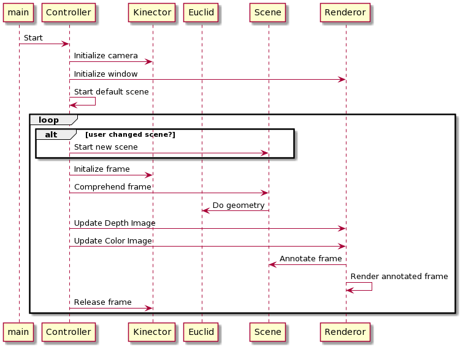

Demonstrates Azure Kinect DK camera body tracking features.  Watch this [youtube video](https://www.youtube.com/watch?v=JbQFNzRO1x0) to see the features in action.

Read the accompanying [medium article](https://marvinpdroid.medium.com/thing-finding-with-kinect-dk-b50470044c56) for a deeper understanding of the APIs and geometry involved.

## Usage
Note: This project has been developed on Ubuntu 20.04. 

### Step 1: Get the [Azure Kinect DK camera](https://www.microsoft.com/en-us/p/azure-kinect-dk/8pp5vxmd9nhq?rtc=1&activetab=pivot:overviewtab)

### Step 2: Install the libraries
The general steps are as outlined in [Microsoft documentation](https://docs.microsoft.com/en-us/azure/Kinect-dk/sensor-sdk-download); but with a couple of hacks to make things work on Ubuntu 20.04.
- use of 18.04 repo, even though OS is 20.04
- installed lower versions of tools and libraries (as latest versions of sensor and body tracker don't seem to be compatible on 20.04) 
```
$ curl -sSL https://packages.microsoft.com/keys/microsoft.asc | sudo apt-key add -
$ sudo apt-add-repository https://packages.microsoft.com/ubuntu/18.04/prod
$ curl -sSL https://packages.microsoft.com/config/ubuntu/18.04/prod.list | sudo tee /etc/apt/sources.list.d/microsoft-prod.list
$ curl -sSL https://packages.microsoft.com/keys/microsoft.asc | sudo apt-key add -
$ sudo apt-get update
$ sudo apt install libk4a1.3-dev
$ sudo apt install libk4abt1.0-dev
$ sudo apt install k4a-tools=1.3.0

````
- Verify sensor library by launching camera viewer
````
$ k4aviewer
````

### Step 3: Other pre-requisites
1. Gnu C Compiler(gcc 9.3.0+)

2. cmake
````sudo apt-get install cmake````

2. ninja-build
````sudo apt-get install ninja-build````

3. Eigen3
````sudo apt-get install libeigen3-dev````

4. Obtain an Azure Vision subscription and store endpoint and key in `AZURE_VISION_ENDPOINT` and `AZURE_VISION_KEY` environment variables respectively.
 
### Step 4: Clone this project

````
$ git clone --recursive https://github.com/mpdroid/bones
````
- `cilantro` will also be cloned as a submodule in `products/extern/cilantro`.

### Step 5: Build and run  
````
$ cd kinect-dk-demo
$ mkdir build
$ cd build
$ cmake .. -GNinja
$ ninja
$ ./bin/bones
````
If all has gone well, you should see the below instructions flash by before camera display is rendered on your monitor;
- Press 'L' for light sabers...
- Press 'O' for object detection; Point with right hand to trigger detection...
- Press 'W' for air-writing; raise left hand above your head and start writing with your right...
- Press 'J' to display joint information...

## How it works
The Azure Kinect DK is a camera device with four major hardware components:
- 12MP RGB camera
- 1MP Depth camera
- Microphone Array
- Motion sensor that includes gyroscope and accelerometer.

In this project, we make use of the  RGB camera, the Depth camera, the [Sensor and Body Tracking](https://docs.microsoft.com/en-us/azure/Kinect-dk/)  SDKs and Azure Cognitive Services to enhance how a person can interact with objects around them in 3-Dimensional space.

- Sensor API methods are wrapped inside `Kinector`.
- `Euclid` wraps body tracking API and implements the geometry. 
- `Renderor` handles presenting camera frames with annotations on application  window.
- `*Scene` classes implement scene comprehension and annotation.



The project applies this basic framework to implement a few body tracking applications: 
- *Displaying Joint Information*: Visualizes the body tracking information by showing the depth position and orientation of a few key joints, directly on the color camera video feed. 
- *Light Sabers*: Attaches light sabers to the hand of each body in the video, by making use of elbow, hand and thumb position and orientation. Demonstrates usage in augmented reality games without the need for expensive controllers physically attached to the human body.
- *Air Writing*: Lets the subject create letters or other artwork in the space around them by simply moving their hands. Demonstrates how to recognize gestures and use them to direct virtual or real-world action based on these gestures.
- *Thing Finder*: Recognizes objects being pointed at by the subject. This demonstrates how to combine body tracking with point cloud geometry and  use Azure cognitive services to create powerful 3-D vision AI applications.
- *and others...*

The project is designed to evolve as a platform. The goal is to make it easy to create new body tracking applications by simply implementing the `AbstractScene` interface.


Watch this [youtube video](https://www.youtube.com/watch?v=JbQFNzRO1x0) to see the features in action.

Read the accompanying [medium article](https://marvinpdroid.medium.com/thing-finding-with-kinect-dk-b50470044c56) for a deeper understanding of the APIs and geometry involved.


## Ackowledgments and References
- [Azure-Kinect-Sensor-SDK](https://github.com/microsoft/Azure-Kinect-Sensor-SDK) - Basics of camera capture and rendering in 2D and 3D
- [Azure-Kinect-Samples](https://github.com/microsoft/Azure-Kinect-Samples) - Advanced examples including body tracking
- [kzampog/cilantro](https://github.com/kzampog/cilantro) - Point Cloud manipulation including clustering
- [ocurnut/imgui](https://github.com/ocornut/imgui) - Rendering depth and camera images with drawing overlays
- [deercoder/cpprestsdk-example](https://github.com/deercoder/cpprestsdk-example) - Using cpprestsdk consume Azure vision services
- [Note on Ray-Plane intersection](https://samsymons.com/blog/math-notes-ray-plane-intersection/)  - by Sam Symons
